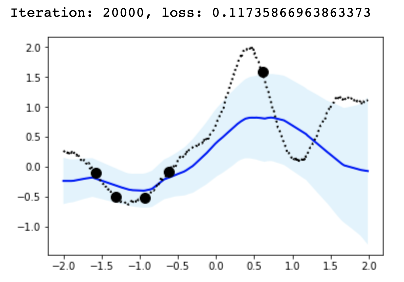
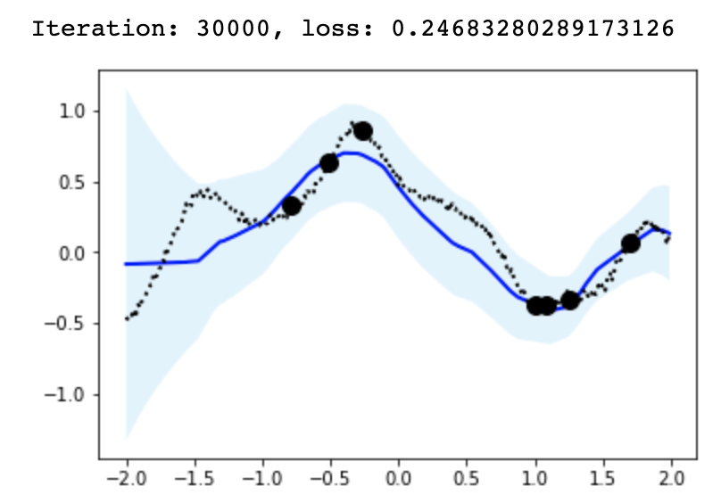
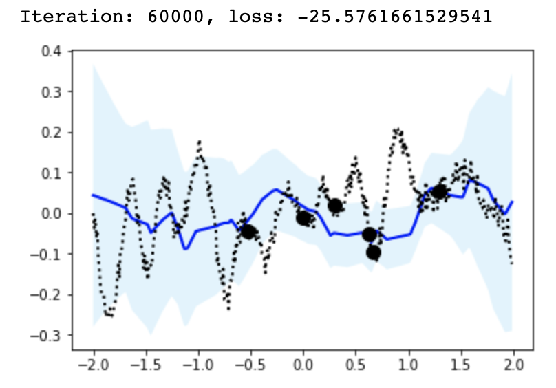
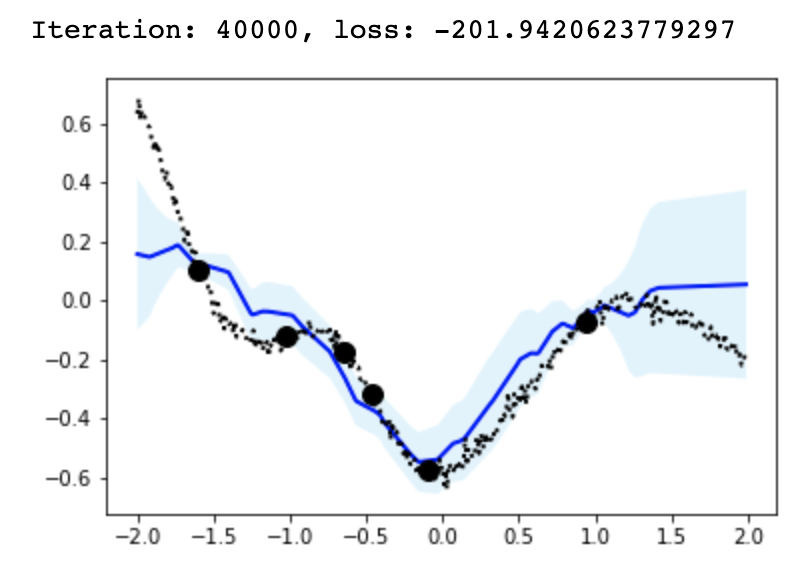

# tf-neural-process
Tensorflow implementation of Neural Process family

- Inspired by deepmind repository [[GIT](https://github.com/deepmind/neural-processes)]
- Paper:
    1. Conditional Neural Process [[arxiv](https://arxiv.org/abs/1807.01613)]
    2. Neural Process [[arxiv](https://arxiv.org/abs/1807.01622)]
    3. Attentive Neural Process [[arxiv](https://arxiv.org/abs/1901.05761)]

## Sample

Jupyter notebook sample is [here](./NeuralProcess.ipynb).

### 1. Conditional Neural Process

Model definition
```python
encoder_output_sizes = [128, 128, 128, 128]
decoder_output_sizes = [128, 128, 1]

model = neural_process.ConditionalNP(encoder_output_sizes, decoder_output_sizes)
```

Sample image 




### 2. Neural Process

Model definition
```python
z_output_sizes = [128, 128, 128, 128]
enc_output_sizes = [128, 128, 128, 128]
dec_output_sizes = [128, 128, 1]

model = neural_process.NeuralProcess(z_output_sizes, enc_output_sizes, dec_output_sizes)
```

Sample image




### 3. Attentive Neural Process

Model definition
```python
z_output_sizes = [128, 128, 128, 128]
enc_output_sizes = [128, 128, 128, 128]
cross_output_sizes = [128, 128, 128, 128]
dec_output_sizes = [128, 128, 1]

self_attention = neural_process.Attention(attention_type='multihead', proj=[128, 128])
cross_attention = neural_process.Attention(attention_type='multihead', proj=[128, 128])

model = neural_process.AttentiveNP(z_output_sizes,
                                   enc_output_sizes,
                                   cross_output_sizes,
                                   dec_output_sizes,
                                   self_attention,
                                   cross_attention)
```

Sample image



